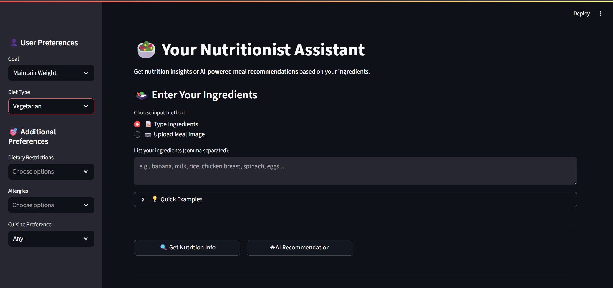
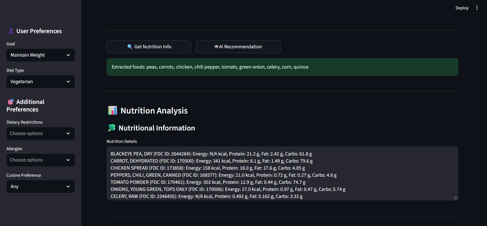
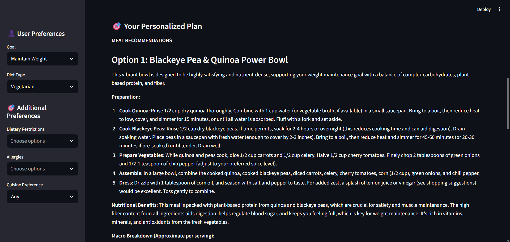

# 🥗 Smart Nutritionist Assistant

<div align="center">
  
**Your Personal AI-Powered Nutrition Expert** 🍎

Analyze food images instantly and receive detailed nutritional insights, calorie breakdowns, and personalized health recommendations powered by Google's Gemini Pro Vision AI.

[Features](#-features) • [Demo](#-demo) • [Installation](#-installation) • [Usage](#-usage) • [Tech Stack](#-tech-stack)

</div>

---

## ✨ Features

<table>
<tr>
<td width="50%">

### 🖼️ **Image Analysis**
Upload any food image and get instant recognition of all ingredients and dishes using advanced AI vision technology.

### 📊 **Nutritional Breakdown**
Receive comprehensive calorie counts and macronutrient information (proteins, carbs, fats) for each identified food item.

</td>
<td width="50%">

### 🎯 **Smart Recommendations**
Get personalized health tips and dietary suggestions based on your nutritional intake and health goals.

### ⚡ **Lightning Fast**
Powered by Google Gemini Pro Vision for rapid, accurate analysis in seconds.

</td>
</tr>
</table>

---

## 🎬 Demo

### 📸 Screenshots

<div align="center">

| Home Screen | Upload Interface | Analysis Results |
|-------------|------------------|------------------|
|  |  |  |

</div>
>

</div>

### ⚡ How It Works

1. **Upload** - Select or drag-and-drop your food image
2. **Analyze** - Click the button to process with AI
3. **Review** - Get detailed nutritional insights instantly
4. **Suggest** - Get recepie's matching your food and personalized requirements 

```
📸 Food Image → 🤖 AI Analysis → 📋 Nutrition Report → 💡 Recommendations
```

---

## 🚀 Installation

### Prerequisites

- Python 3.8 or higher
- Google API Key for Gemini Pro Vision
- pip package manager

### Quick Start

**1. Clone the repository**
```bash
git clone https://github.com/Sarthak221105/Smart_Nutritionist_Assistantant.git
cd Smart_Nutritionist_Assistantant
```

**2. Create a virtual environment** (recommended)
```bash
# Windows
python -m venv venv
venv\Scripts\activate

# macOS/Linux
python3 -m venv venv
source venv/bin/activate
```

**3. Install dependencies**
```bash
pip install -r requirements.txt
```

**4. Set up environment variables**

Create a `.env` file in the root directory:
```env
GOOGLE_API_KEY=your_google_api_key_here
```

To get your Google API key:
- Visit [Google AI Studio](https://makersuite.google.com/app/apikey)
- Create a new API key
- Copy and paste it into your `.env` file

---

## 💻 Usage

**Start the application:**
```bash
streamlit run app.py
```

The app will open automatically in your default browser at `http://localhost:8501`

**Using the Assistant:**

1. Upload a food image using the file uploader (JPG, JPEG, or PNG)
2. Enter any specific dietary concerns.
3. Click "Get Nutrition Info" to analyze
4. View your comprehensive nutritional report
5. Get suggested recepies according to your preferences

---

## 🛠️ Tech Stack

| Technology | Purpose |
|------------|---------|
| **Python** | Core programming language |
| **Streamlit** | Interactive web application framework |
| **Google Gemini Pro Vision** | AI-powered image analysis and nutrition recognition |
| **Pillow (PIL)** | Image processing and manipulation |
| **python-dotenv** | Environment variable management |

---

## 📁 Project Structure

```
Smart_Nutritionist_Assistant/
│
├── app.py                 # Main Streamlit application
├── requirements.txt       # Python dependencies
├── .env                   # Environment variables (create this)
├── .gitignore            # Git ignore rules
├── README.md             # Project documentation
└── demo/                 # Demo screenshots and media
    ├── home.png
    ├── upload.png
    ├── results.png
    └── demo.gif
```

---

## 🔧 Configuration

### Environment Variables

| Variable | Description | Required |
|----------|-------------|----------|
| `GOOGLE_API_KEY` | Your Google Gemini API key | ✅ Yes |

### Supported Image Formats

- JPG / JPEG
- PNG

---

## 🤝 Contributing

Contributions are welcome! Here's how you can help:

1. **Fork** the repository
2. **Create** a feature branch (`git checkout -b feature/AmazingFeature`)
3. **Commit** your changes (`git commit -m 'Add some AmazingFeature'`)
4. **Push** to the branch (`git push origin feature/AmazingFeature`)
5. **Open** a Pull Request

---

## 📝 License

This project is open source and available under the [MIT License](LICENSE).

---

## 👨‍💻 Author

**Sarthak**

- GitHub: [@Sarthak221105](https://github.com/Sarthak221105)
- Project Link: [Smart Nutritionist Assistant](https://github.com/Sarthak221105/Smart_Nutritionist_Assistantant)

---

## 🙏 Acknowledgments

- Google Gemini AI for providing powerful vision capabilities
- Streamlit for the amazing framework
- The open-source community for continuous inspiration

---

## 📞 Support

Having issues? Here's how to get help:

- 🐛 **Bug Reports**: [Open an issue](https://github.com/Sarthak221105/Smart_Nutritionist_Assistantant/issues)
- 💡 **Feature Requests**: [Start a discussion](https://github.com/Sarthak221105/Smart_Nutritionist_Assistantant/discussions)
- 📧 **Contact**: Reach out through GitHub

---

<div align="center">

**Made with ❤️ and AI**

⭐ Star this repo if you find it helpful!

</div>
