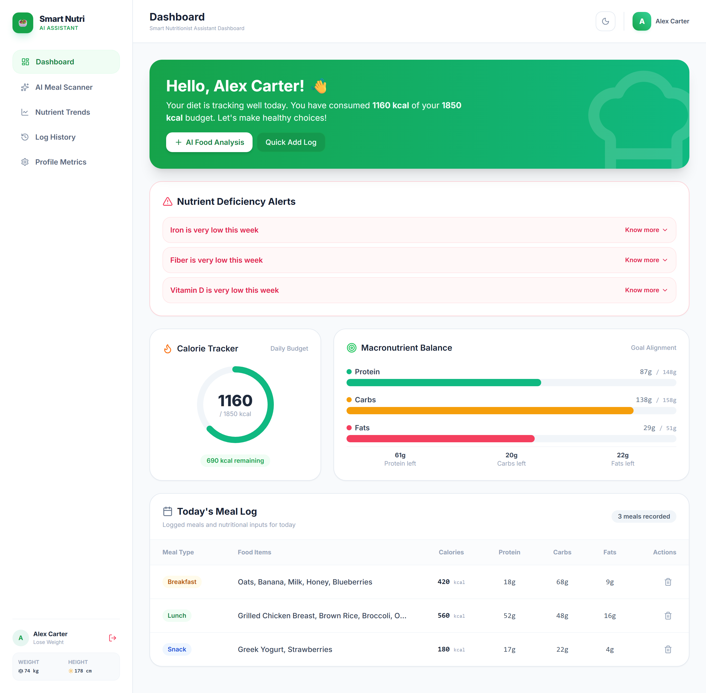
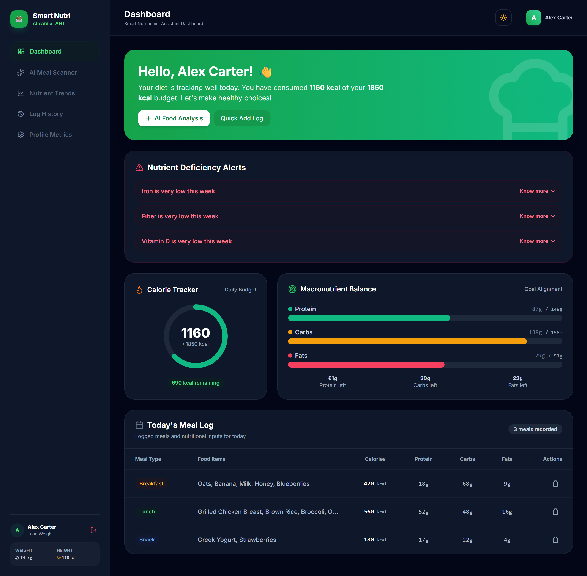
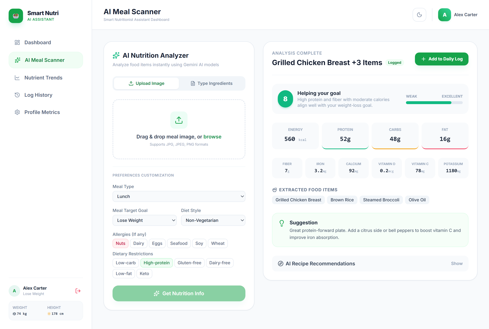
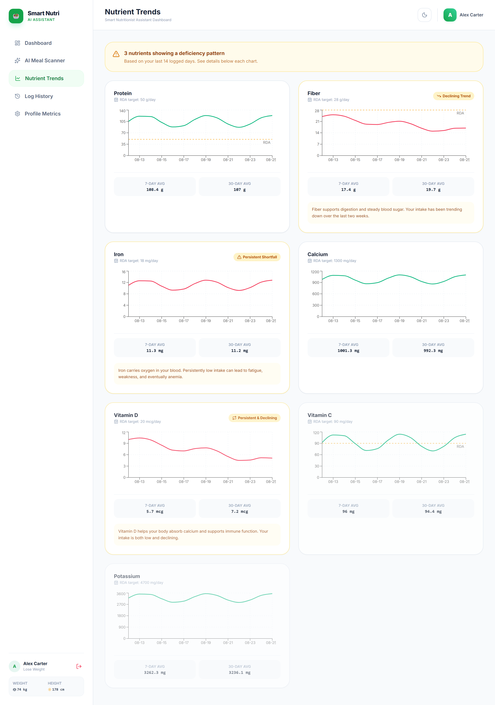
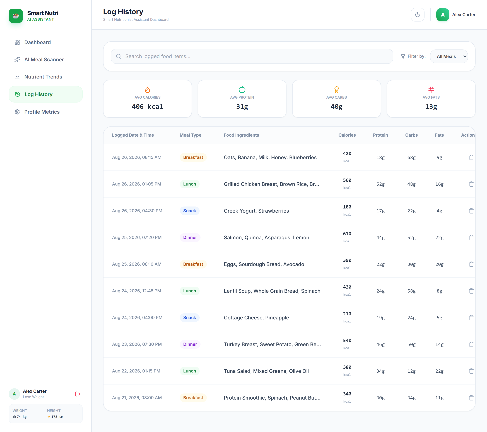
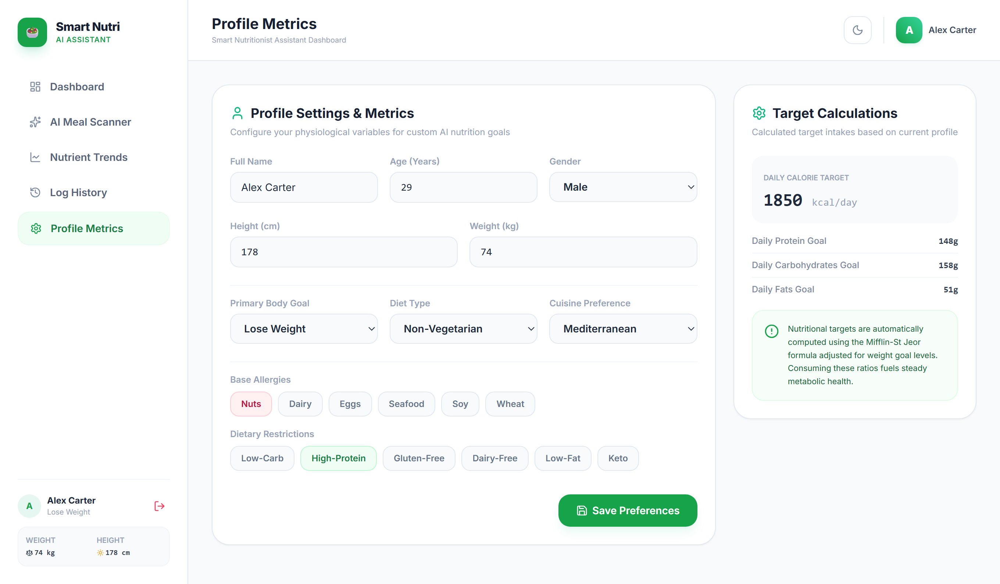
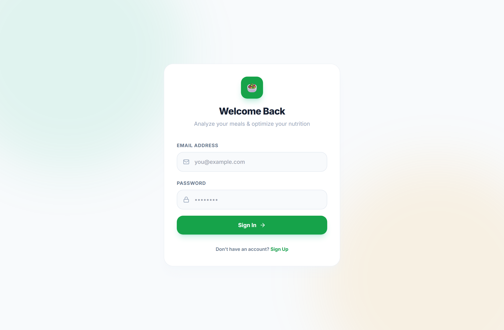

# 🥗 Smart Nutritionist Assistant

**AI-powered nutrition tracking** — analyze meals from a photo or text, get a real macro/micronutrient breakdown, track nutrient gaps over time, and receive goal-aligned suggestions and recipe ideas.



> **Note:** This project began as a single-file Streamlit app but is now a three-service web application (React + Node/Express + Python/Flask). If you're looking for the old Streamlit version, see `app.py` (legacy, no longer the primary entrypoint).

---

## ✨ Features

- **Meal analysis from image or text** — upload a food photo or type ingredients; the backend extracts the food items and computes nutrition.
- **Real macro + micronutrient breakdown** — calories, protein, carbs, fat, plus fiber, iron, calcium, vitamin D, vitamin C, and potassium, sourced from the USDA FoodData Central database.
- **Goal alignment** — each meal is scored (helping / neutral / hindering) against the user's goal (lose / maintain / gain) with a short, concrete suggestion.
- **Nutrient Gap Tracker** — every logged meal is stored with a timestamp; the app computes rolling 7-day and 30-day averages and flags nutrients that stay below their recommended daily value.
- **Nutrient Trends tab** — per-nutrient trend charts with deficiency flags and plain-language explanations.
- **Dashboard deficiency alerts** — once you've logged 7+ days, the Dashboard surfaces currently-deficient nutrients with "Know more" food suggestions.
- **AI recipe recommendations** — semantic search over an 80k-recipe corpus (MongoDB Atlas Vector Search) plus an LLM-written consultation.
- **Personalization** — goal, diet style (veg/vegan/non-veg), allergies, dietary restrictions, cuisine preference, and meal type (breakfast/lunch/dinner/snack).

---

## 📸 Screenshots

> The screens below are captured from the current React app with sample data.

### Dashboard

Daily calorie ring, macronutrient balance, nutrient-deficiency alerts, and today's meal log — in light and dark themes.

| Light | Dark |
|-------|------|
|  |  |

### AI Meal Scanner

Upload a meal photo or type ingredients, then get a macro + micronutrient breakdown, a goal-alignment score, a concrete suggestion, and AI recipe recommendations.



### Nutrient Trends

Per-nutrient 30-day charts with RDA reference lines, rolling 7-day / 30-day averages, and deficiency-pattern flags (persistent shortfall, declining trend).



### Log History

A searchable, meal-type-filterable history of every logged meal, with rolling averages up top.



### Profile Metrics & Sign In

Profile drives the Mifflin–St Jeor target calculations. Access is gated by Firebase Authentication.

| Profile Metrics | Sign In |
|-----------------|---------|
|  |  |

---

## 🏗️ Architecture

Three services:

```
  React frontend (Vite)          Node / Express API            Python / Flask service
  frotend/  :5173         ──▶     js_backend/  :5000     ──▶    api_server.py  :5001
  - Firebase Auth (client)        - Firebase Admin (verify)     - Food extraction (vision/text)
  - Dashboard, Scanner,           - Diet logs, profile,         - USDA nutrition lookup
    Nutrient Trends, History        recommendations             - Diet analysis + recipe RAG
  - Tailwind, framer-motion,      - Nutrient trends aggregation
    recharts                      - Proxies /analyze ──────────▶ (Python service)
                                  - MongoDB Atlas (Mongoose)
```

**External services:** MongoDB Atlas (users, diet logs, recommendations, `recipeEmbeddings`), Firebase Authentication, USDA FoodData Central API, Google Gemini API, NVIDIA-hosted vision models.

### Vision provider
Food extraction from images uses **NVIDIA Llama-3.2-90B-Vision** as the primary provider (chosen after benchmarking: accurate, no hallucinations, and not subject to Gemini's free-tier daily quota). It **falls back to Google Gemini** automatically on any technical failure (missing key, timeout, non-200).

### Recipe RAG
Recipes were embedded with `sentence-transformers/all-MiniLM-L6-v2` (384-dim) and migrated into a MongoDB Atlas collection queried via `$vectorSearch`. See [Deployment notes](#-deployment-notes) for an important memory caveat.

---

## 🛠️ Tech Stack

| Layer | Technologies |
|-------|-------------|
| **Frontend** | React 19, Vite, Tailwind CSS, framer-motion, Recharts, Firebase Auth |
| **API / auth layer** | Node.js, Express, Mongoose, Firebase Admin, Multer, MongoDB Atlas |
| **AI / analysis service** | Python, Flask, NVIDIA Llama-3.2-90B-Vision, Google Gemini, USDA FoodData Central, ChromaDB / sentence-transformers (migration), MongoDB Atlas Vector Search |

---

## 📁 Project Structure

```
Ai_Nutritionist/
├── api_server.py            # Flask AI service (/analyze, /health)
├── text_extraction.py       # Image/text food extraction (NVIDIA primary, Gemini fallback)
├── nutrition_info.py        # USDA lookup + macro/micronutrient totals
├── diet_analyzer.py         # Structured goal-alignment assessment (Gemini)
├── llm_model.py             # AI consultation + recipe recommendations
├── recipe_query.py          # Recipe vector search (Atlas $vectorSearch)
├── requirements.txt         # Python dependencies
├── migration/               # One-off ChromaDB -> Atlas recipe migration scripts
│
├── js_backend/              # Node/Express API
│   ├── server.js
│   ├── controllers/         # auth, diet, recommendations, nutrients
│   ├── models/              # User, DietLog, Recommendation, RecipeEmbedding
│   ├── routes/              # auth, diet, recommendation, nutrition, nutrient
│   ├── config/              # nutrientTargets.js (RDA + deficiency thresholds)
│   └── utils/               # nutrientAnalysis.js (rolling stats + deficiency detection)
│
└── frotend/                 # React app
    └── src/
        ├── components/      # Dashboard, MealScanner, NutrientTrends, History,
        │                    #   Settings, DeficiencyAlerts, Auth
        ├── context/         # AuthContext, NutritionContext
        └── data/            # nutrientFoodSuggestions.js
```

---

## 🚀 Setup

### Prerequisites
- Python 3.10+, Node.js 18+
- Accounts/keys: MongoDB Atlas, Firebase project, Google Gemini API key, USDA API key, NVIDIA API key

### 1. Python AI service
```bash
pip install -r requirements.txt
python api_server.py        # serves on :5001
```
Root `.env`:
```env
MONGO_URI=<your Atlas connection string>   # used by recipe vector search
GEMINI_API_KEY=<google gemini key>         # (GOOGLE_API_KEY also accepted)
USDA_API_KEY=<usda fooddata central key>
NVIDIA_API_KEY=<nvidia api key>            # primary vision provider
PORT=5001
```

### 2. Node / Express API
```bash
cd js_backend
npm install
npm start                   # serves on :5000
```
`js_backend/.env`:
```env
MONGO_URI=<your Atlas connection string>
JWT_SECRET=<any secret>
PORT=5000
# Firebase Admin: either FIREBASE_SERVICE_ACCOUNT (JSON string) in env,
# or a local js_backend/firebase-key.json (gitignored)
```

### 3. React frontend
```bash
cd frotend
npm install
npm run dev                 # serves on :5173
```
`frotend/.env`:
```env
VITE_FIREBASE_API_KEY=...
VITE_FIREBASE_AUTH_DOMAIN=...
VITE_FIREBASE_PROJECT_ID=...
VITE_FIREBASE_STORAGE_BUCKET=...
VITE_FIREBASE_MESSAGING_SENDER_ID=...
VITE_FIREBASE_APP_ID=...
VITE_NODE_BACKEND_URL=http://localhost:5000     # deployed URL in prod
VITE_PYTHON_BACKEND_URL=http://localhost:5001   # deployed URL in prod
```
For local development, put the localhost URLs in `frotend/.env.local` (gitignored) so they override any deployed URLs committed in `.env`.

---

## 🔧 Configuration reference

| Variable | Service | Purpose |
|----------|---------|---------|
| `NVIDIA_API_KEY` | Python | Primary vision model for food extraction |
| `GEMINI_API_KEY` / `GOOGLE_API_KEY` | Python | Fallback vision + diet analysis + recipe consultation |
| `USDA_API_KEY` | Python | Macro/micronutrient lookup |
| `MONGO_URI` | Python + Node | MongoDB Atlas (recipe search + app data) |
| `JWT_SECRET` | Node | Token signing |
| Firebase service account | Node | Verifies frontend Firebase ID tokens |
| `VITE_*` | Frontend | Firebase client config + backend URLs |

Nutrient RDA targets and deficiency-detection thresholds live in
`js_backend/config/nutrientTargets.js` (not hardcoded in logic).

---

## 📦 Deployment notes

- The frontend deploys to Vercel; the two backends deploy to Render.
- **Memory caveat (recipe search):** `recipe_query.py` loads a
  sentence-transformers model (~400 MB with its dependencies) in-process to
  embed the search query. This does **not** fit in Render's 512 MB free tier
  and will OOM / time out the `/analyze` request when recipe search runs. On
  the free tier, either disable recipe vector search (revert `search_recipe`
  to a no-op), compute the query embedding via a hosted embedding API, or use
  a larger instance.
- **Gemini free-tier quota** is 20 requests/day per project per model.
  Regenerating the API key does **not** reset it (it's per-project, resets
  daily). This is why NVIDIA is the primary vision provider.

---

## 📝 License

Open source under the [MIT License](LICENSE).
